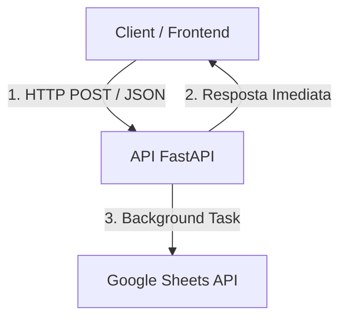

## 🎯 Teste Vocacional Digital - API & Data Analytics

Plataforma web interativa desenvolvida para aplicação de testes vocacionais direcionados a estudantes do Ensino Médio. O sistema processa as respostas em tempo real por meio de um algoritmo ponderado e realiza a persistência assíncrona dos dados para análise agregada de perfis (Exatas, Humanas e Biológicas).

🌐 **Aplicação em Produção:** 
[https://teste-vocacional-fastapi.onrender.com]
(https://teste-vocacional-fastapi.onrender.com)

---

## 📌 Sumário

- [Visão Geral e Impacto Social](#-visão-geral-e-impacto-social)
- [Tecnologias Utilizadas](#-tecnologias-utilizadas)
- [Arquitetura do Sistema](#-arquitetura-do-sistema)
- [Estrutura do Banco / Tabela de Dados](#-estrutura-do-banco--tabela-de-dados)
- [Endpoints da API](#-endpoints-da-api)
---

## 🚀 Visão Geral e Impacto Social

O projeto visa mitigar a escassez de ferramentas acessíveis de orientação vocacional no ambiente escolar, oferecendo:
- **Resposta Instantânea:** Algoritmo de cálculo de afinidade com retorno imediato para o estudante.
- **Gestão Baseada em Dados (*Data for Good*):** Armazenamento estruturado de dados que permite a coordenações pedagógicas mapear o perfil vocacional de turmas e planejar feiras de profissões, oficinas e ações direcionadas.
- **Acessibilidade:** Interface leve e multiplataforma, otimizada para uso em smartphones e computadores.

---

## 🛠️ Tecnologias Utilizadas

- **Backend:** Python 3, FastAPI, Pydantic, Uvicorn.
- **Persistência & Integração:** `gspread`, Google Sheets API (OAuth2 Service Account).
- **Processamento Assíncrono:** `BackgroundTasks` do FastAPI.
- **Frontend:** HTML5, CSS3, JavaScript (Fetch API, Audio API).
- **Hospedagem / Deployment:** Render.

---

## 📐 Arquitetura do Sistema

O pipeline de dados opera com separação entre a resposta ao cliente e a gravação na planilha, garantindo performance e zero latência no frontend:

---

## 📊 Estrutura do Banco / Tabela de Dados

Os registros enviados via API são gravados na planilha seguindo a estrutura abaixo:
| Coluna | Campo | Tipo | Descrição | Exemplo |
| :--- | :--- | :--- | :--- | :--- |
| **A** | `usuario_id` | Varchar | Identificador único gerado automaticamente | `USR-8472` |
| **B** | `data_hora` | Datetime | Data e horário da submissão | `08/08/2026 14:30:00` |
| **C** | `nome` | Varchar | Nome do participante | `Maria Silva` |
| **D** | `telefone` | Varchar | WhatsApp / Contato informado | `(16) 99999-9999` |
| **E** | `area_vencedora` | Varchar | Perfil resultante (`EXATAS`, `HUMANAS`, `BIOLÓGICAS` ou `EMPATE`) | `EXATAS` |
| **F** | `exatas` | Float | Pontuação ponderada calculada em Exatas | `9.3` |
| **G** | `humanas` | Float | Pontuação ponderada calculada em Humanas | `3.3` |
| **H** | `biologicas` | Float | Pontuação ponderada calculada em Biológicas | `6.4` |
## 🔌 Endpoints da API
GET /api/perguntas

Sorteia e retorna uma amostra de perguntas cadastradas no pool.

    Resposta (200 OK):

JSON

[
  {
    "id": 1,
    "texto": "Mexer nas configurações de apps para otimizar tudo é sua vibe?",
    "area": "exatas"
  }
]

POST /api/resultado

Processa as respostas do questionário, calcula as pontuações e agenda a gravação dos dados em segundo plano.

    Body da Requisição:

JSON

{
  "nome": "Maria Silva",
  "telefone": "16999999999",
  "respostas": [
    { "pergunta_id": 1, "escolha": "SIM" },
    { "pergunta_id": 21, "escolha": "TALVEZ" }
  ]
}

    Resposta (200 OK):

JSON

{
  "usuario_id": "USR-4819",
  "areas_vencedoras": ["EXATAS"],
  "texto_completo": "Seu perfil principal é: EXATAS! 🎯",
  "imagem_url": "/static/exatas.png",
  "pontuacoes": {
    "exatas": 9.3,
    "humanas": 3.3,
    "biologicas": 6.4
  }
}

---

## 🔧 Como Rodar o Projeto Localmente

    Clone o repositório:
    Bash

    git clone [https://github.com/mascarol/teste-vocacional-fastAPI.git](https://github.com/mascarol/teste-vocacional-fastAPI.git)
    cd teste-vocacional-fastAPI

    Crie e ative um ambiente virtual:
    Bash

    python3 -m venv .venv
    source .venv/bin/activate

    Instale as dependências:
    Bash

    pip install -r requirements.txt

    Configure as credenciais do Google Sheets:
    Coloque o arquivo credentials.json na raiz do projeto (ou configure a variável de ambiente GOOGLE_CREDENTIALS).

    Inicie o servidor de desenvolvimento:
    Bash

    uvicorn main:app --reload

        Ambiente Local: Acesse http://127.0.0.1:8000 no navegador.

        Ambiente Online: Acesse https://teste-vocacional-fastapi.onrender.com.

---
##🔐 Variáveis de Ambiente

Para implantação em serviços como Render, configure a seguinte variável no painel da plataforma (Environment Variables):

    GOOGLE_CREDENTIALS: Conteúdo bruto do arquivo credentials.json formatado como string JSON.
